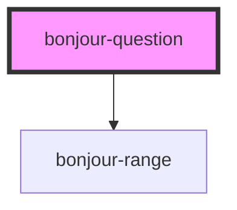

# bonjour-question

<!-- Auto Generated Below -->

## Properties

| Property | Attribute | Description                                       | Type     | Default |
| -------- | --------- | ------------------------------------------------- | -------- | ------- |
| `max`    | `max`     | The maximal value                                 | `number` | `5`     |
| `min`    | `min`     | The minimal value                                 | `number` | `1`     |
| `start`  | `start`   | The default position of the range on load         | `number` | `1`     |
| `steps`  | `steps`   | How many steps between the min and the max values | `number` | `1`     |

## Methods

### `getValue() => Promise<number>`

Get the current value of the range respectively the current answer

#### Returns

Type: `Promise<number>`

## Slots

| Slot         | Description                                                                |
| ------------ | -------------------------------------------------------------------------- |
| `"high"`     | A definition of the highest value of the range of answers. Commonly a text |
| `"low"`      | A definition of the lowest value of the range of answers. Commonly a text  |
| `"question"` | A text for the question itself                                             |

## CSS Custom Properties

| Name                       | Description                                                              |
| -------------------------- | ------------------------------------------------------------------------ |
| `--question-background`    | The background of the question's container, default #ffffff.             |
| `--question-border-sizing` | The box sizing property of the question's container, default border-box. |
| `--question-high-padding`  | The padding of the high placeholder.                                     |
| `--question-low-padding`   | The padding of the low placeholder.                                      |
| `--question-padding`       | The padding of the question's container, default 16px 32px.              |
| `--question-width`         | A width for the question's container.                                    |

## Dependencies

### Depends on

- [bonjour-range](../range)

### Graph

----------------------------------------------

*Built with [StencilJS](https://stenciljs.com/)*
