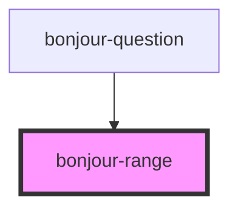

# bonjour-range

<!-- Auto Generated Below -->

## Properties

| Property | Attribute | Description                                       | Type     | Default |
| -------- | --------- | ------------------------------------------------- | -------- | ------- |
| `max`    | `max`     | The maximal value                                 | `number` | `5`     |
| `min`    | `min`     | The minimal value                                 | `number` | `1`     |
| `start`  | `start`   | The default position of the range on load         | `number` | `1`     |
| `steps`  | `steps`   | How many steps between the min and the max values | `number` | `1`     |

## Methods

### `getValue() => Promise<number>`

Get the current value of the range

#### Returns

Type: `Promise<number>`

## CSS Custom Properties

| Name                       | Description                                                                     |
| -------------------------- | ------------------------------------------------------------------------------- |
| `--range-thumb-background` | The background of the range's thumb, default linear-gradient(#FFFFFF, #CCC4C1). |
| `--range-thumb-border`     | The border of the range's thumb, default 2px solid #8f7c76.                     |
| `--range-track-background` | The background of the range's track, default #F0F0ED.                           |
| `--range-track-fill`       | The fill color of the range's track, default #FB9196.                           |

## Dependencies

### Used by

 - [bonjour-question](../question)

### Graph

----------------------------------------------

*Built with [StencilJS](https://stenciljs.com/)*
